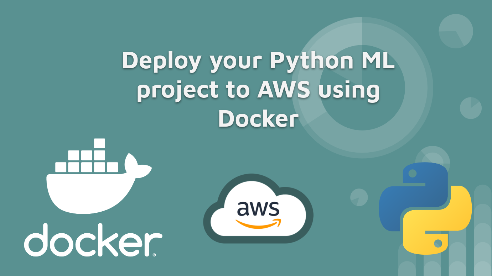
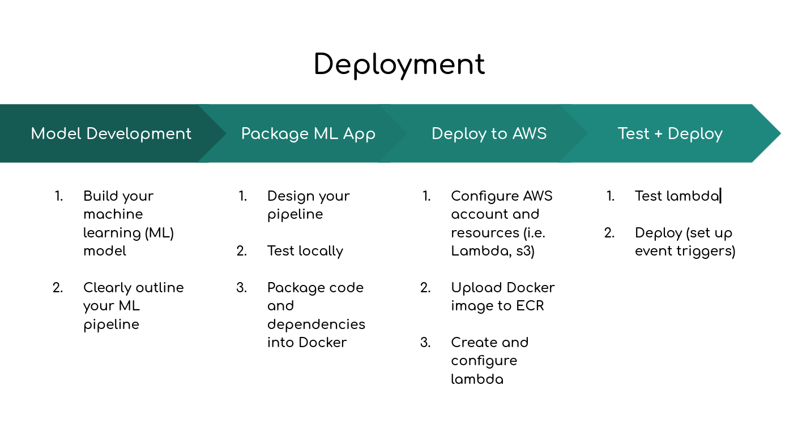

# DEPLOY-PYTHON-ML

Basic machine learning (ML) project to illustrate steps to deploying to AWS Lambda using Docker.

This repo is part of the YouTube video [How to Deploy a Python Machine Learning App using Docker + AWS Lambda](https://www.youtube.com/watch?v=x4-HR2sAzng)

## Data Science Process

Some super basic data science/machine learning project. I basically went on Kaggle, looked up "nlp dataset" and downloaded the first one with sufficient data. Then I copied and pasted old code on here.

## How do I build the model?

Make sure you have [conda](https://docs.conda.io/en/latest/miniconda.html) installed. Then, install the requirements with `bash install_requirements.sh`.

Finally, you can build the model by running `python build_model.py` on the terminal.

## How do I test the app?

`RUNNING_LOCAL=True python -m app.main`
or
`RUNNING_LOCAL=True FILENAME=model-dev/data/emotion-labels-test.csv python -m app.main`
where `FILENAME` is any file with `text` in the header.

## Directory structure

    deploy-python-ml/
    ├── app
    │   ├── model
    │   ├── preprocessing
    └── model-dev
        └── data

## Deployment

General steps to deploy your code include

1.  Build your machine learning model and pipeline
2.  Create/setup a AWS account
3.  Package your code in a Docker container
4.  Upload your Docker image to AWS Elastic Container Registry (ECR)
5.  Create your AWS Lambda to run the ECR image
6.  Run/test/configure your AWS Lambda
7.  Deliver your results to others who may need the results

