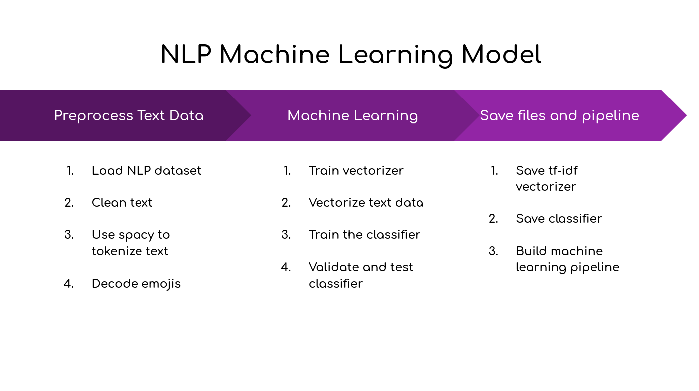

# Machine Learning Development

## build the model...that's all

Run `python install_requirements.sh` to install the requirements. Then, run `python build_model.py`. Easy two steps.

## data

Source of the data https://www.kaggle.com/datasets/anjaneyatripathi/emotion-classification-nlp

## Process

